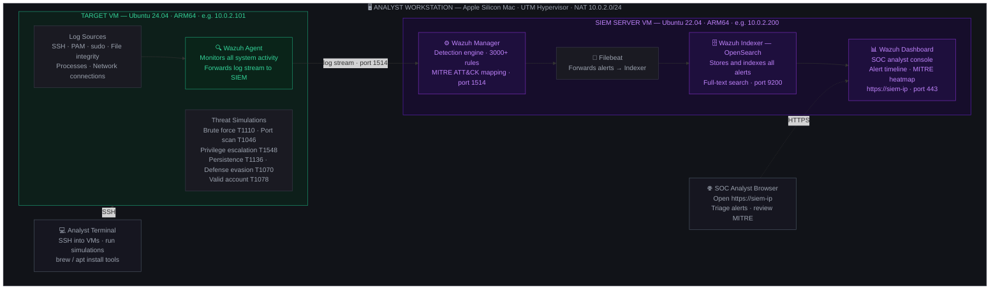

# Build Your Own SOC Lab

> This is the complete step-by-step guide to building the same lab from scratch on Apple Silicon (ARM64). Every component is installed manually, every ARM64-specific issue is documented, every error and fix is included.

> If you are on Windows or an Intel Mac — the design is identical. Replace UTM with VirtualBox or VMware and select `amd64` packages instead of `aarch64` wherever mentioned.

Part of [esc - SOC Home Lab](../README.md)

---

## 🗺️ What You Are Building

Before the installation steps — here is the complete picture of what this lab looks like when finished. Every component, every connection, every data flow.




**Reading the diagram:**
- **Target VM** — the machine being monitored. The Wazuh agent lives here and ships everything it sees to the SIEM server.
- **SIEM server** — four components working in a pipeline: Manager detects → Filebeat forwards → Indexer stores → Dashboard shows.
- **Solid arrows** — log and alert data flowing through the pipeline automatically.
- **Dashed arrows** — you interacting with the lab (SSH from terminal, browser to view alerts).

Everything runs inside your Mac on an isolated NAT network. Nothing is exposed to the internet.

---

## 🔧 Building Your SOC Lab

> ⚠️ **Tested on:** MacBook Pro M5 · UTM 4.x · macOS Tahoe · Wazuh 4.14.5 · May 2026

> 📋 These steps are verified to work on this setup. If you are on a different M-series Mac (M1/M2/M3/M4) the steps are identical. Different UTM versions may have slightly different UI but the same core functionality.

### Before You Start

- **Follow the parts in order** — each part depends on the previous one completing successfully.
- **Stuck on a step?** Open a [Discussion](https://github.com/MrFixer-02/esc/discussions) — describe the step you're on and paste what you see.
- **Getting an error?** Copy the exact message and search it — most ARM64 issues are documented somewhere online.
- **Take UTM snapshots** before major steps so you can roll back without starting from scratch.

This guide installs Wazuh **component by component** using apt, not the all-in-one installer script. The official `wazuh-install.sh` has a dashboard initialization timeout on ARM64 — the installer waits 5 minutes for the dashboard to start, but ARM64 systems need 10-15 minutes. The install always fails at this step. We skip the script entirely and install each component directly — this also gives you a better understanding of the architecture.

### Tricky Step Legend

| Tag | Meaning |
|---|---|
| ⚡ **TRICKY STEP** | High chance of error — read the full step before running anything |
| 💡 **NOTE** | Important context that affects the next steps |
| ✅ **VERIFY** | Run this check before continuing — do not skip |

---

### Part 0 — Homebrew (Start Here)

**Homebrew** is macOS's package manager — think of it as the App Store for terminal tools. One command installs almost anything. You will use it throughout this lab and beyond.

```bash
/bin/bash -c "$(curl -fsSL https://raw.githubusercontent.com/Homebrew/install/HEAD/install.sh)"
```

Install essential tools:
```bash
brew install nmap wget git
brew install --cask utm
```

> 💡 Every tool on your Mac gets installed through Homebrew. Everything inside the Linux VMs gets installed through apt. Two package managers, two environments — keep them separate.

---

### Part 1 — Ubuntu Target VM

**1.1 — Download Ubuntu 24.04 ARM64 ISO**
```bash
cd ~/Downloads
wget https://cdimage.ubuntu.com/releases/24.04/release/ubuntu-24.04-live-server-arm64.iso
```

✅ **VERIFY** — File should be ~2 GB:
```bash
ls -lh ~/Downloads/ubuntu-24.04-live-server-arm64.iso
```

**1.2 — Create VM in UTM**

Open UTM → `+` → **Virtualize** → **Linux**

| Setting | Value |
|---|---|
| Boot ISO | ubuntu-24.04-live-server-arm64.iso |
| RAM | 4096 MB · CPU: 2 cores · Storage: 32 GB |
| Network | Shared Network (NAT) |
| Name | `Ubuntu-Target-SIEM` |

⚡ **TRICKY STEP** — Always select **Virtualize**, not Emulate. Emulate is 10-20x slower.

**1.3 — Install Ubuntu Server**

- Language: English · Keyboard: English (US)
- Type: **Ubuntu Server** (not minimized)
- Network: leave as default
- Storage: Use entire disk — **uncheck LVM**
- ⚡ **TRICKY STEP** — On the SSH screen, check **Install OpenSSH server**. Without this you cannot SSH in from Mac Terminal.
- Snaps: skip everything

⚡ **TRICKY STEP — Post-install reboot loop**
If the VM boots back into the installer: shut down → UTM VM Settings → Drives → remove the ISO entry → reboot.

**1.4 — SSH in from Mac**
```bash
ip addr show          # inside VM — note the 192.168.64.X address
ssh yourusername@192.168.64.2   # from Mac Terminal
```

✅ **VERIFY** — Prompt shows `yourusername@Ubuntu-Target-SIEM:~$`

---

### Part 2 — Wazuh Server VM

💡 **NOTE** — The Wazuh server must run **Ubuntu 22.04 LTS**, not 24.04. Using 24.04 causes package dependency failures.

**2.1 — Download Ubuntu 22.04 ARM64 ISO**
```bash
wget https://cdimage.ubuntu.com/releases/22.04/release/ubuntu-22.04.5-live-server-arm64.iso
```

✅ **VERIFY** — File should be ~1.9 GB.

**2.2 — Create VM in UTM**

| Setting | Value |
|---|---|
| Boot ISO | ubuntu-22.04.5-live-server-arm64.iso |
| RAM | 4096 MB · CPU: 2 cores · Storage: **50 GB** |
| Network | Shared Network (NAT) · Name: `wazuh-server` |

**2.3 — Install Ubuntu and SSH in**

Same process as Part 1. Enable SSH. Then from Mac Terminal:
```bash
ssh yourusername@192.168.64.4
```

All remaining commands run inside this SSH session.

**2.4 — Expand LVM to full disk**

⚡ **TRICKY STEP** — Ubuntu installer allocates only ~23.5G by default even on a 50G disk. Wazuh Indexer fills this during initialization and will fail with `No space left on device` if not expanded first.

```bash
sudo lvextend -l +100%FREE /dev/ubuntu-vg/ubuntu-lv
sudo resize2fs /dev/mapper/ubuntu--vg-ubuntu--lv
```

✅ **VERIFY:** `df -h /` — total should reflect the full 50G disk.

---

### Part 3 — Install Wazuh

💡 **NOTE** — The all-in-one `wazuh-install.sh` script fails on ARM64 with a dashboard initialization timeout — the installer waits 5 minutes for the dashboard to start, but ARM64 needs 10-15 minutes. The installation exits before the dashboard is ready. We install each component via apt instead.

**3.1 — Update system and add Wazuh repository**
```bash
sudo apt update && sudo apt upgrade -y
sudo apt install curl gnupg2 -y

curl -s https://packages.wazuh.com/key/GPG-KEY-WAZUH | sudo gpg --no-default-keyring \
  --keyring gnupg-ring:/usr/share/keyrings/wazuh.gpg --import && \
  sudo chmod 644 /usr/share/keyrings/wazuh.gpg

echo "deb [signed-by=/usr/share/keyrings/wazuh.gpg] https://packages.wazuh.com/4.x/apt/ stable main" | \
  sudo tee /etc/apt/sources.list.d/wazuh.list

sudo apt update
```

**3.2 — Install Wazuh Indexer**
```bash
sudo apt install wazuh-indexer -y
```

**3.3 — Generate SSL Certificates**

⚡ **TRICKY STEP** — chmod files individually FIRST, then lock the directory. Locking first blocks your own access to the files inside.

```bash
sudo curl -sO https://packages.wazuh.com/4.14/wazuh-certs-tool.sh
sudo curl -sO https://packages.wazuh.com/4.14/config.yml

sudo sed -i 's/<indexer-node-ip>/192.168.64.4/g' config.yml
sudo sed -i 's/<wazuh-manager-ip>/192.168.64.4/g' config.yml
sudo sed -i 's/<dashboard-node-ip>/192.168.64.4/g' config.yml

sudo bash ./wazuh-certs-tool.sh -A
sudo chmod 755 ~/wazuh-certificates/
sudo chmod 644 ~/wazuh-certificates/*.pem
```

**3.4 — Deploy Indexer certificates**
```bash
sudo mkdir /etc/wazuh-indexer/certs
sudo cp ~/wazuh-certificates/node-1.pem /etc/wazuh-indexer/certs/indexer.pem
sudo cp ~/wazuh-certificates/node-1-key.pem /etc/wazuh-indexer/certs/indexer-key.pem
sudo cp ~/wazuh-certificates/admin.pem /etc/wazuh-indexer/certs/admin.pem
sudo cp ~/wazuh-certificates/admin-key.pem /etc/wazuh-indexer/certs/admin-key.pem
sudo cp ~/wazuh-certificates/root-ca.pem /etc/wazuh-indexer/certs/root-ca.pem
sudo chmod 400 /etc/wazuh-indexer/certs/*.pem
sudo chmod 500 /etc/wazuh-indexer/certs
sudo chown -R wazuh-indexer:wazuh-indexer /etc/wazuh-indexer/certs
```

**3.5 — Start Indexer and initialize security**
```bash
sudo systemctl daemon-reload
sudo systemctl enable wazuh-indexer
sudo systemctl start wazuh-indexer
sleep 30
sudo /usr/share/wazuh-indexer/bin/indexer-security-init.sh
sleep 30
sudo systemctl restart wazuh-indexer
sleep 30
```

✅ **VERIFY:**
```bash
curl -k -u admin:admin https://192.168.64.4:9200
```
Should return JSON with `"cluster_name": "wazuh-cluster"`. If you see `OpenSearch Security not initialized` — wait 30 more seconds and retry.

**3.6 — Install Wazuh Manager**
```bash
sudo apt install wazuh-manager -y
sudo systemctl daemon-reload
sudo systemctl enable wazuh-manager
sudo systemctl start wazuh-manager
```

✅ **VERIFY:** `sudo systemctl status wazuh-manager --no-pager` → `Active: active (running)`

**3.7 — Install and configure Filebeat**

⚡ **TRICKY STEP** — The default Filebeat template uses `${username}` and `${password}` placeholders that must be replaced manually. It also references SSL cert filenames that don't match what the cert tool generates — both need fixing before Filebeat will start.

```bash
sudo apt install filebeat -y

sudo curl -so /tmp/wazuh-filebeat.tar.gz \
  https://packages.wazuh.com/4.x/filebeat/wazuh-filebeat-0.4.tar.gz
sudo tar -xvz -f /tmp/wazuh-filebeat.tar.gz -C /usr/share/filebeat/module

sudo curl -so /etc/filebeat/filebeat.yml \
  https://packages.wazuh.com/4.14/tpl/wazuh/filebeat/filebeat.yml
sudo sed -i 's|hosts:.*|hosts: ["192.168.64.4:9200"]|' /etc/filebeat/filebeat.yml
sudo nano /etc/filebeat/filebeat.yml
```

Find `output.elasticsearch:` and make it look exactly like this:
```yaml
output.elasticsearch:
  username: "admin"
  password: "admin"
  hosts: ["192.168.64.4:9200"]
  protocol: https
  ssl.certificate_authorities:
    - /etc/filebeat/certs/root-ca.pem
  ssl.certificate: "/etc/filebeat/certs/wazuh-manager.pem"
  ssl.key: "/etc/filebeat/certs/wazuh-manager-key.pem"
```

Remove any `${username}` or `${password}` lines. Save: `Ctrl+X` → `Y` → Enter.

```bash
sudo curl -so /etc/filebeat/wazuh-template.json \
  https://raw.githubusercontent.com/wazuh/wazuh/v4.14.5/extensions/elasticsearch/7.x/wazuh-template.json
sudo chmod go+r /etc/filebeat/wazuh-template.json

sudo mkdir /etc/filebeat/certs && sudo chmod 755 /etc/filebeat/certs
sudo cp ~/wazuh-certificates/root-ca.pem /etc/filebeat/certs/root-ca.pem
sudo cp ~/wazuh-certificates/wazuh-1.pem /etc/filebeat/certs/wazuh-manager.pem
sudo cp ~/wazuh-certificates/wazuh-1-key.pem /etc/filebeat/certs/wazuh-manager-key.pem
sudo chmod 400 /etc/filebeat/certs/*.pem
sudo chmod 500 /etc/filebeat/certs

sudo systemctl daemon-reload
sudo systemctl enable filebeat
sudo systemctl start filebeat
```

✅ **VERIFY:** `sudo systemctl status filebeat --no-pager` → `Active: active (running)`

**3.8 — Install Wazuh Dashboard**

⚡ **TRICKY STEP** — The dashboard expects `dashboard.pem` but the cert tool generates `wazuh-dashboard.pem`. Fix with symlinks.

```bash
sudo apt install wazuh-dashboard -y

sudo mkdir /etc/wazuh-dashboard/certs && sudo chmod 755 /etc/wazuh-dashboard/certs
sudo cp ~/wazuh-certificates/root-ca.pem /etc/wazuh-dashboard/certs/root-ca.pem
sudo cp ~/wazuh-certificates/dashboard.pem /etc/wazuh-dashboard/certs/wazuh-dashboard.pem
sudo cp ~/wazuh-certificates/dashboard-key.pem /etc/wazuh-dashboard/certs/wazuh-dashboard-key.pem
sudo chmod 400 /etc/wazuh-dashboard/certs/*.pem
sudo ln -s /etc/wazuh-dashboard/certs/wazuh-dashboard.pem /etc/wazuh-dashboard/certs/dashboard.pem
sudo ln -s /etc/wazuh-dashboard/certs/wazuh-dashboard-key.pem /etc/wazuh-dashboard/certs/dashboard-key.pem
sudo chmod 500 /etc/wazuh-dashboard/certs
sudo chown -R wazuh-dashboard:wazuh-dashboard /etc/wazuh-dashboard/certs

sudo systemctl daemon-reload
sudo systemctl enable wazuh-dashboard
sudo systemctl start wazuh-dashboard
```

Wait 60-90 seconds. Then open `https://192.168.64.4` in your Mac browser.

Browser will show "Not Secure" — normal for self-signed certificates. Click Advanced → Proceed.

Login: `admin` / `admin` ← change this after first login.

---

### Part 4 — Enroll the Agent

**4.1 — Get install command from dashboard**

Dashboard → ☰ → **Endpoints** → **Deploy new agent**

- OS: Linux · Package: **DEB aarch64** ← do NOT pick amd64
- Server address: `192.168.64.4` · Agent name: `ubuntu-target`

Copy the generated command.

**4.2 — Install on the target VM**
```bash
ssh yourusername@192.168.64.2
# paste the generated command
sudo systemctl daemon-reload
sudo systemctl enable wazuh-agent
sudo systemctl start wazuh-agent
```

✅ **VERIFY** — Dashboard → Endpoints → `ubuntu-target` shows green **Active** within 60 seconds.

---

## 🔐 Default Credentials & Security

Your lab runs on UTM's NAT network — completely isolated from the internet and your home network. Nobody outside your Mac can reach your VMs even if they know the default credentials.

| Service | Username | Password |
|---|---|---|
| Wazuh Dashboard | `admin` | `admin` |
| Wazuh API | `wazuh` | `wazuh` |

> ⚠️ Always keep UTM on **Shared Network (NAT)** mode. Never use Bridged mode for a security lab.

Want to change credentials or ran into auth errors? The complete guide covers password change, username change, ARM64-specific bugs, and full recovery steps.

👉 [Complete Credentials & Security Guide](../references/credentials.md)

## 🚨 Alerts & Detection

### Trigger Your First Alert

From Mac Terminal:
```bash
ssh wronguser@192.168.64.2
```
Wrong password 3 times → `Ctrl+C`. Repeat once more.

### What You Will See

Dashboard → **Threat Hunting → Events**:

| Rule ID | Level | Description |
|---|---|---|
| `5710` | 5 | sshd: Attempt to login using a non-existent user |
| `5503` | 5 | PAM: User login failed |
| `2502` | 10 | User missed the password more than one time |

Wazuh automatically maps these to **MITRE ATT&CK T1110 — Brute Force**.

### What Wazuh Detects Out of the Box

- Authentication events — failed logins, sudo, new users
- File integrity — changes to `/etc/passwd`, `/etc/shadow`, critical files
- Process monitoring — suspicious processes, privilege escalation
- Log analysis — syslog, auth.log, application logs
- Vulnerability detection — CVEs in installed packages
- Rootkit detection — common rootkit signatures

---

## 🔭 Make It Yours

### Popular Additions

**Attack capability:** [Kali Linux](https://www.kali.org/get-kali/#kali-virtual-machines) · [Metasploit](https://www.metasploit.com/) · [Burp Suite](https://portswigger.net/burp/communitydownload)

**More detection:** [Suricata](https://suricata.io/) · [Zeek](https://zeek.org/) · [Wireshark](https://www.wireshark.org/)

**More SIEMs:** [Splunk Free](https://www.splunk.com/en_us/download.html) · [Elastic Security](https://www.elastic.co/security) · [Microsoft Sentinel](https://azure.microsoft.com/en-us/products/microsoft-sentinel)

**Vulnerable targets:** [DVWA](https://github.com/digininja/DVWA) · [Metasploitable](https://sourceforge.net/projects/metasploitable/) · [VulnHub](https://www.vulnhub.com/)

**Incident response:** [TheHive](https://thehive-project.org/) · [Shuffle](https://shuffler.io/) · [OpenCTI](https://www.opencti.io/)

⭐ **Star** · 👁️ **Watch** · 🍴 **Fork** — to follow updates or build your own version.

---

## 📋 Common Errors & Fixes

| Error | Cause | Fix |
|---|---|---|
| `ERROR: Incompatible system. Must be 64-bit` | Wazuh installer rejects ARM64 | Install components via apt — skip the installer script |
| Dashboard never comes up — browser can't connect after install | Dashboard initialization timeout on ARM64 — service waits 5 min, ARM64 needs 10-15 min | Wait 10-15 minutes. If still failing: `sudo systemctl restart wazuh-dashboard && sleep 120` |
| `No space left on device` during indexer initialization | Ubuntu allocates ~23.5G by default even on a 50G disk | `sudo lvextend -l +100%FREE /dev/ubuntu-vg/ubuntu-lv && sudo resize2fs /dev/mapper/ubuntu--vg-ubuntu--lv` |
| Filebeat running but no alerts appear in dashboard | Wazuh Filebeat module not downloaded | Download `wazuh-filebeat-0.4.tar.gz` and extract to `/usr/share/filebeat/module` |
| No alert data in Indexer — dashboard shows blank | Wazuh index template not loaded | Download `wazuh-template.json` and run `filebeat setup --index-management` |
| VirusTotal integration runs but rules 87101/87105 never fire | Free tier v2 API deprecated — all free keys return empty responses | Patch `virustotal.py` to use v3 endpoint (`https://www.virustotal.com/api/v3/files/{hash}`) with `x-apikey` header |
| Active response script runs but threat file is not deleted | Wazuh user lacks write permission to `/tmp` in chroot environment | `sudo chmod 1777 /tmp` |
| `OpenSearch Security not initialized` | Indexer not fully warmed up | Wait 30s, restart indexer, re-run security init |
| `missing field: output.elasticsearch.username` | Filebeat config placeholders | Replace `${username}` and `${password}` in filebeat.yml |
| `ENOENT: dashboard-key.pem not found` | Cert filename mismatch | Symlink `dashboard.pem → wazuh-dashboard.pem` |
| `chmod: cannot access certs/*` | Directory locked before files chmod'd | chmod files first, then chmod the directory |
| VM boots back into installer | ISO still attached in UTM | Remove ISO from VM Settings → Drives |
| Agent shows `Never Connected` | Agent cannot reach manager | Check Manager is running, verify IP in `/var/ossec/etc/ossec.conf` |

---

## 🐛 Found an Issue?

If a step didn't work for you — open a GitHub Issue. Include your Mac model, macOS version, and UTM version. Reports from different setups help make this guide better for everyone.

👉 [Open an Issue](https://github.com/MrFixer-02/esc/issues)

---

## 💬 Share Your Build

Got your lab running? Drop a note in [Discussions](https://github.com/MrFixer-02/esc/discussions) — setup variations, alternate configs, things that didn't work, or just to say it ran.

---

*Part of [esc - SOC Home Lab](https://github.com/MrFixer-02/esc) · Built by [deadlilac](https://github.com/MrFixer-02)*
